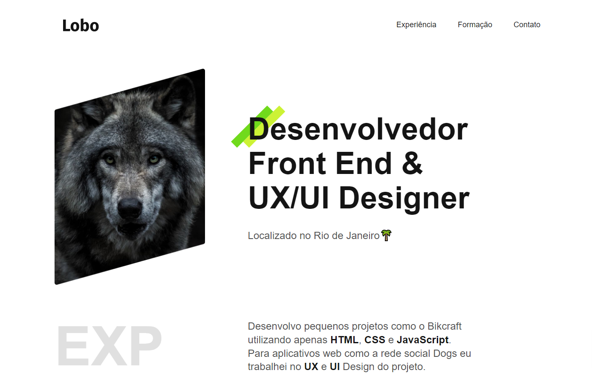

<h1 align="center">
  💻 Repositório Fictício
</h1>

  

<h4 align="center"><a href="https://repositorio-ficticio.vercel.app/" target="_blank">Clique para visitar o projeto</a></h4>

## 📚 Sobre o projeto

Projeto desenvolvido durante o <strong>curso de HTML e CSS da Origamid.</strong> 
Se trata de um portifólio com informações fictícias, colocando em prática todo conhecimento abordado até o momento e dividinho o CSS em módulos diferentes. 🚀

## 🛠️ Tecnologias utilizadas

- HTML;
- CSS;
